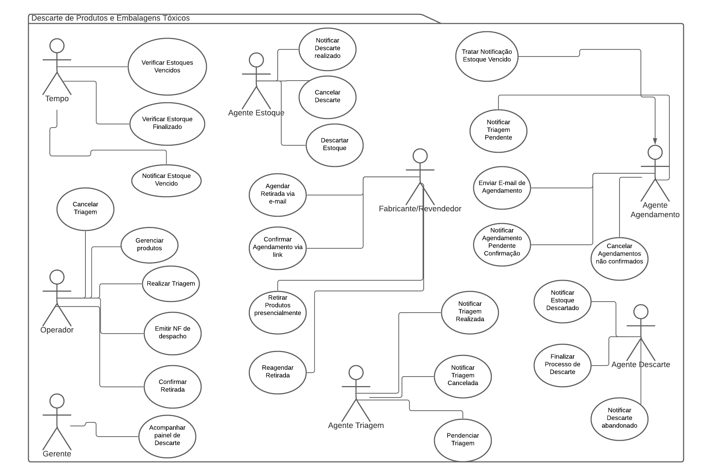
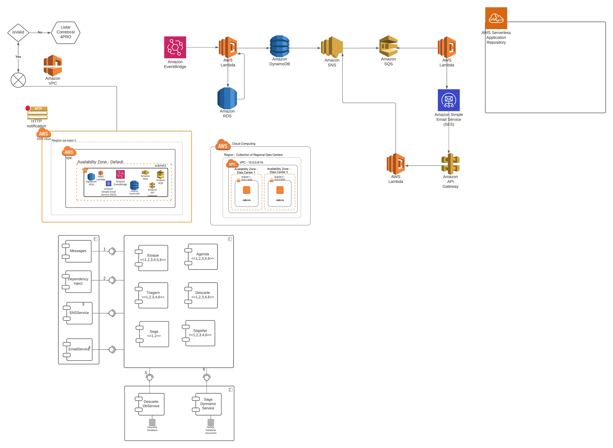
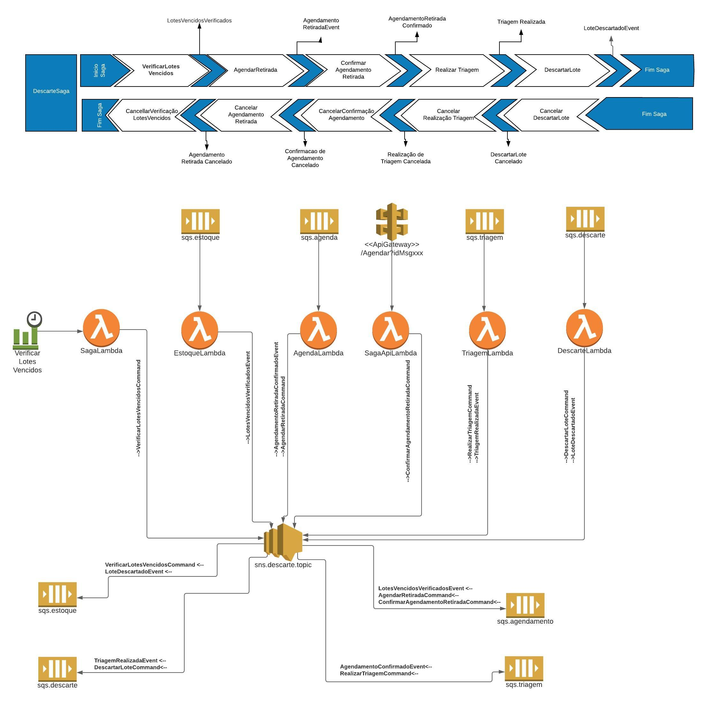
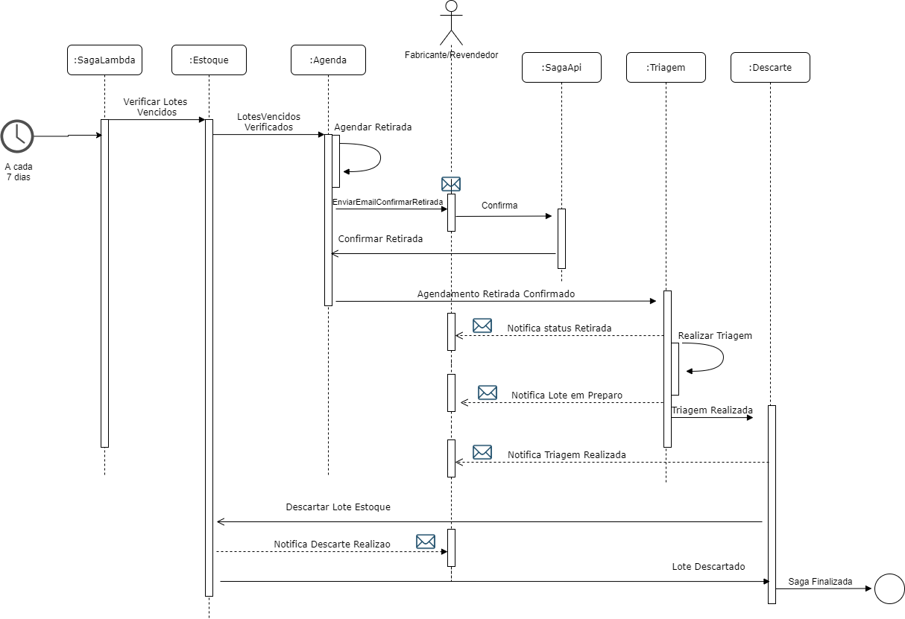
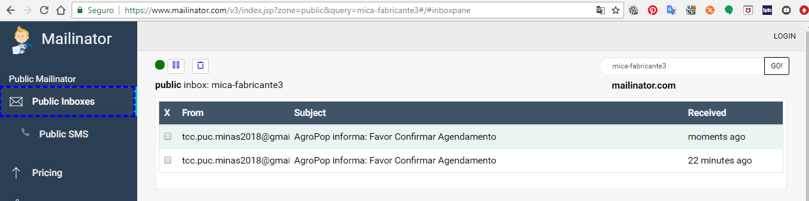
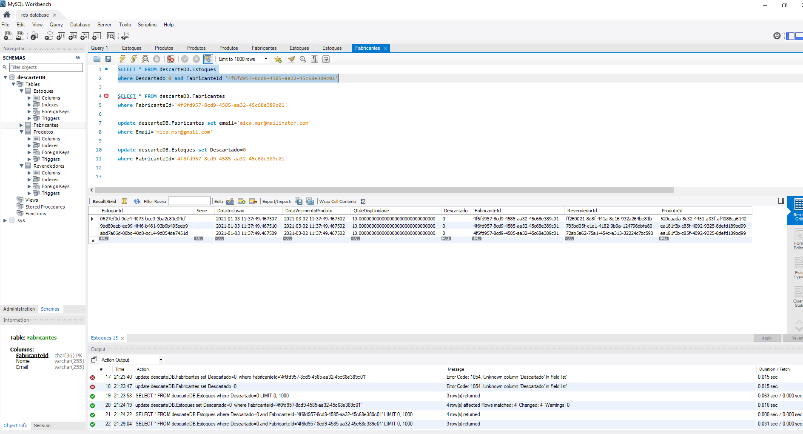

# AgroPop Saga: descarte de embalagens e produtos agrotóxicos

Prova de conceito do Trabalho de Conclusão de Curso (TCC) da Pós-graduação em Arquitetura de Software Distribuído da PUC Minas. O trabalho aplica o padrão arquitetural **Saga** para tratar a consistência eventual entre microsserviços serverless na AWS. O caso de negócio é o descarte de produtos e embalagens de agrotóxicos no agronegócio.

- **Autora:** Michelle de Souza Rodrigues
- **Curso:** Pós-graduação Lato Sensu em Arquitetura de Software Distribuído, PUC Minas, Núcleo de Educação a Distância
- **Documento do TCC:** *Sistema de e-commerce para produtos do agronegócios*, Rio de Janeiro, 2021 ([PUC-tcc.doc](docs_tcc/PUC-tcc.doc))
- **Apresentação:** *Descarte de Embalagens e Produtos de Agrotóxicos* ([apresentacao_projeto_arquitetural_TCC.pptx](docs_tcc/apresentacao_projeto_arquitetural_TCC.pptx))
- **Vídeos da prova de conceito:** [parte 1](https://www.youtube.com/watch?v=LoC8igz9V4s), [parte 2](https://www.youtube.com/watch?v=P7K7ErxjQHM), [parte 3](https://www.youtube.com/watch?v=gi21hSRmZI0)
- **Período:** 16/12/2020 (primeiro commit) a 28/04/2021 (versão final do documento e da apresentação)
- **Tecnologias:** .NET Core 3.1, AWS Lambda, Amazon SNS, Amazon SQS, Amazon DynamoDB, Amazon RDS (MySQL), Amazon API Gateway, Amazon EventBridge

> As datas deste README vêm do histórico do git. Os arquivos de [docs_tcc/](docs_tcc/) continuam nos caminhos originais para não perder esse histórico. O inventário com as datas de cada arquivo está em [Documentos do TCC](#documentos-do-tcc), e o resumo cronológico, em [Linha do tempo](#linha-do-tempo).

## Sumário

1. [Proposta](#proposta)
2. [Requisitos](#requisitos)
3. [Modelagem](#modelagem)
4. [Arquitetura](#arquitetura)
5. [Prova de conceito](#prova-de-conceito)
6. [Avaliação da arquitetura](#avaliação-da-arquitetura)
7. [Conclusões](#conclusões)
8. [Estrutura do repositório](#estrutura-do-repositório)
9. [Como compilar e implantar](#como-compilar-e-implantar)
10. [Documentos do TCC](#documentos-do-tcc)
11. [Linha do tempo](#linha-do-tempo)
12. [Referências](#referências)

## Proposta

> Este trabalho tem como objetivo explicitar o padrão arquitetural Saga na solução da consistência eventual de microsserviços em arquitetura distribuída. O case utilizado é de Descarte de produtos e embalagens de agrotóxicos no ramo do agronegócio.
>
> *Slide 2 da apresentação*

### Contexto

O [enunciado do curso](docs_tcc/escopo%20Sistema%20Controle%20vendas%20e%20estoque%20produtos%20agroneg%C3%B3cios-2017-1.docx) pede a arquitetura de um novo sistema integrado de comércio de produtos agropecuários. O sistema deve ser modular e implantável por módulos: vendas, estoque, descarte de embalagens e produtos vencidos, logística de entrega, comunicação com clientes especiais, propagandas e promoções, e relatórios. Ele também precisa se integrar aos sistemas de três agentes externos:

- **Fornecedores:** fornecem os produtos e recebem solicitações de orçamento e de compra.
- **Clientes especiais:** integram os próprios sistemas para consultar preços e solicitar orçamentos.
- **Fabricantes e revendedores:** cuidam do descarte de embalagens e do recolhimento de agrotóxicos vencidos, e precisam ser avisados sobre o que descartar.

No TCC, a empresa fictícia **AgroPop** tem fluxos demorados ou manuais e alto custo operacional. A nova solução deve ser resiliente a falhas, ter alta disponibilidade e manutenção fácil, com baixo acoplamento e alta coesão.

### Objetivos

- Descrever o projeto arquitetural do sistema de e-commerce para produtos do agronegócio.
- Permitir a implantação por módulo e garantir a entrega das requisições mesmo que o sistema fique indisponível por um tempo.
- Prever a integração com o sistema COBOL que transmite as notas de despacho de mercadorias.
- Entregar uma prova de conceito com casos de uso críticos para a arquitetura. Aqui, o escolhido foi o **controle de descarte de embalagens e produtos vencidos**.

## Requisitos

### Requisitos funcionais

Em negrito, os requisitos cobertos pela prova de conceito.

- Clientes especiais solicitam orçamentos de compra e consultam preços e produtos disponíveis.
- Fabricantes e revendedores são informados sobre o descarte de produtos agrotóxicos vencidos.
- Vendedores internos usam um módulo de controle de vendas no navegador, e os clientes compram pelo celular através do site.
- Fornecedores recebem pedidos de orçamento por meio de um serviço.
- O controle de vendas é integrado ao controle de estoque, garantindo o orçamento e a venda informados.
- **O controle de estoque sinaliza os produtos vencidos e prontos para descarte ao controle de descarte, e esses produtos deixam de estar disponíveis para venda.**
- **O controle de descarte recebe a notificação de produtos vencidos e avisa os fornecedores sobre o recolhimento.**
- **Fornecedores e revendedores agendam a retirada e recebem por e-mail o andamento do agendamento e do descarte.**
- O sistema controla o status das entregas, informado pela empresa terceirizada a cada etapa do despacho.
- Um módulo de relacionamento envia promoções e outras comunicações aos clientes especiais.
- Um módulo de relatórios emite relatórios de vendas, produtos em estoque, produtos vencidos, rentabilidade e custos.
- **O sistema usa fila de mensagens, garantindo a entrega das requisições aos módulos.**

### Requisitos não funcionais

| RNF | Requisito | Medida da resposta (resumo) | Coberto na POC |
|---|---|---|---|
| RNF01 | Implantável por módulo | Durante a implantação de um módulo, os módulos que dependem dele continuam disponíveis. | sim |
| RNF02 | Boa usabilidade | Termos, ícones, rótulos e mensagens são entendidos por todos os públicos. | |
| RNF03 | Web responsivo e ambientes móveis | O sistema é responsivo nos navegadores mais conhecidos e em dispositivos móveis. | |
| RNF04 | Rápido | Processamento assíncrono com resposta síncrona; o usuário é notificado a cada novo status. | sim |
| RNF05 | Manutenção facilitada | Cada módulo tem responsabilidades bem definidas, e a manutenção é pontual. | sim |
| RNF06 | Simples para testar | Com injeção de dependência, cada método de cada classe pode ser testado de forma unitária. | sim |
| RNF07 | Comunicação com os sistemas dos agentes, alguns em COBOL/CICS | Integração por HTTP e troca de arquivos por FTP, sem depender da tecnologia de cada agente. | |
| RNF08 | Operar em qualquer período do dia e da noite | Alta disponibilidade e escalabilidade automática na cloud pública da AWS. | sim |
| RNF09 | Altos padrões de segurança | Toda a operação roda nas VPCs da AWS, com acesso controlado pelo IAM. | sim |
| RNF10 | Integração contínua | Todo código alterado fica rastreado no repositório a cada entrega. | |
| RNF11 | Implantação contínua | O código entregue é implantado no ambiente correspondente em até 1 minuto. | |
| RNF12 | Alta disponibilidade | Disponível 7 dias por semana, com "disponibilidade de até 97% de cada hora do dia". | sim |

Os cenários completos de cada requisito (estímulo, fonte, ambiente, artefato, resposta e medida) estão na seção 2.2 do [documento do TCC](docs_tcc/PUC-tcc.doc).

### Restrições de projeto

- A linguagem deve ser da plataforma .NET (Core).
- O sistema deve usar AWS Lambda com SNS e SQS.
- O sistema deve abrir de forma responsiva em aparelhos menores, como celular e tablet.
- O sistema deve ser modular, para facilitar a implantação.
- As integrações com sistemas legados devem usar o padrão WS-Security (WSS).

### Mecanismos arquiteturais

| Mecanismo de análise | Mecanismo de design | Mecanismo de implementação |
|---|---|---|
| Persistência | Banco de dados relacional | SQL Server |
| Persistência | Framework ORM | Entity Framework Core, Code First |
| Acesso a dados em memória | Framework de cache | MemoryCache |
| Status report e comunicação de erros | Framework de webmail | MailMessage |
| Mecanismo de comunicação | Padrão arquitetural | Microsserviços com Saga Pattern |
| Automatização de processo | WebJob | AWS EventBridge |
| Comunicação entre processos | API Gateway AWS | API Gateway / SNS |
| Dashboard de disponibilidade | AWS CloudWatch | CloudWatch Dashboard |
| Log de processos | AWS CloudWatch | Log Groups |
| Auditoria | AWS CloudWatch | Log Groups |
| Mecanismo de transporte | Fila de mensagens / tópicos | SQS / SNS |
| Build | Ferramenta de compilação | .NET Core 3.1 |
| Deploy | Configuração da IDE de deploy | Visual Studio Code |
| Front-end | Interface de comunicação com o usuário do portal | Angular com TypeScript, CSS e HTML 5 |

No protótipo, a persistência relacional usa **MySQL no Amazon RDS** (pacote `Pomelo.EntityFrameworkCore.MySql`) em vez de SQL Server, e o andamento da saga fica gravado no **DynamoDB**.

## Modelagem

### Casos de uso



Os atores são o Tempo, o Operador, o Gerente, o Fabricante/Revendedor e os agentes de software de Estoque, Agendamento, Triagem e Descarte. O diagrama de casos de uso do sistema completo (vendas, estoque, fornecedores, logística, promoções e relatórios) está em [diagrama_caso_uso.jpg](docs_tcc/diagrama_caso_uso.jpg), com o arquivo-fonte do Astah em [diagrama_caso_uso.asta](docs_tcc/diagrama_caso_uso.asta).

<details>
<summary><strong>Histórias de usuário (HS01 a HS14)</strong></summary>

- **HS01:** Como fabricante/revendedor, quero ser notificado por e-mail com uma semana de antecedência sobre os produtos prestes a vencer. *(UC1, agente Agendamento)*
- **HS02:** Como fabricante/revendedor, quero ser notificado por e-mail sobre os descartes pendentes de agendamento. *(UC2, agente Agendamento)*
- **HS03:** Como operador, quero ser notificado diariamente dos agendamentos iminentes para realizar a triagem da retirada. *(UC3, agente Triagem)*
- **HS04:** Como fabricante/revendedor, quero ser notificado das triagens realizadas dos descartes que agendei, para ir até o local retirar os produtos. *(UC4, Operador)*
- **HS05:** Como fabricante/revendedor, quero que um agendamento não confirmado seja cancelado automaticamente, para poder fazer um novo agendamento. *(UC5, Agendamento)*
- **HS06:** Como fabricante/revendedor, quero (re)agendar a retirada de produtos vencidos ou finalizados. *(UC6, Fabricante/Revendedor)*
- **HS07:** Como operador, quero ser notificado dos agendamentos confirmados para separar e embalar os produtos vencidos ou finalizados. *(UC7, Robô)*
- **HS08:** Como operador, fabricante ou revendedor, quero poder cancelar um agendamento. *(UC8, Operador/Fabricante/Revendedor)*
- **HS09:** Como operador, quero dar baixa no descarte realizado, para confirmar o estoque presente. *(UC9, Operador)*
- **HS10:** Como gerente, quero visualizar os produtos em trânsito para descarte e todo o seu ciclo de descarte. *(UC10, Gerente)*
- **HS11:** Como administrador do sistema, quero visualizar todo o ciclo de descarte de embalagens para garantir o funcionamento e a disponibilidade do sistema. *(UC11, Administrador)*
- **HS12:** Como gerente, quero gerenciar o cadastro de fabricantes, revendedores, clientes e clientes especiais. *(UC12, Gerente)*
- **HS13:** Como operador, quero ter acesso ao gerenciamento de produtos. *(UC13, Operador)*
- **HS14:** Como gerente, quero ter acesso ao gerenciamento completo do estoque e do descarte de embalagens. *(UC14, Gerente)*

A narrativa que deu origem a essas histórias está em [historia de usuário.txt](docs_tcc/historia%20de%20usu%C3%A1rio.txt), e o levantamento inicial dos casos de uso por agente, em [identificação_casos_de_Uso.txt](docs_tcc/identifica%C3%A7%C3%A3o_casos_de_Uso.txt).

</details>

<details>
<summary><strong>Caso de uso crítico implementado: gerenciar o descarte de embalagens</strong></summary>

- **Ator principal:** Robô
- **Agente:** Tempo
- **Pré-condição:** existem produtos vencidos ou finalizados, sem agendamento prévio, no banco de dados.
- **Pós-condição:** o fabricante/revendedor recebeu por e-mail os links para agendamento.

**Fluxo principal**

1. Semanalmente, o robô verifica os produtos vencidos na base de dados.
   - 1a. Não há produtos aptos para descarte: fim do caso de uso.
2. O sistema prepara o e-mail com os links dos agendamentos possíveis.
3. O robô envia os e-mails aos fabricantes/revendedores. *(HS01)*
4. O fabricante/revendedor recebe o e-mail de descarte pendente. *(HS02)*
5. O fabricante clica no link de agendamento. *(HS06)*
   - 5a. O link está vencido: o sistema envia um e-mail de link expirado e o caso de uso termina.
6. O sistema agenda a retirada.
   - 6a. O robô cancela os agendamentos não confirmados e o caso de uso termina.
7. O sistema notifica o operador sobre o agendamento. *(HS07)*
8. Semanalmente, o robô verifica os agendamentos iminentes.
9. O robô notifica o operador da triagem pendente.
10. O operador recebe a notificação e confirma a triagem.
11. O sistema notifica o fornecedor/revendedor de que a triagem terminou. *(HS03)*
12. O fornecedor/revendedor retira o descarte no local.
13. O operador confirma que o descarte foi feito com sucesso.
14. O sistema dá baixa no estoque e notifica o operador e o fabricante/revendedor.
15. O gerente visualiza o fluxo de descarte de embalagens.

</details>

## Arquitetura

### Estilos e padrões

- **Estilos arquiteturais:** arquitetura baseada em componentes e N-Tier. A aplicação não tem camada de apresentação; o foco está nas camadas de serviço, de acesso a dados e de infraestrutura.
- **Padrões arquiteturais:** microsserviços, mensageria com o EIP Saga (coreografia) e serverless na AWS.

### Componentes e implantação



*O arquivo [Diagramas.jpeg](docs_tcc/Diagramas.jpeg) reúne o diagrama de implantação (fluxo entre os serviços da AWS e a VPC na região sa-east-1) e, na parte de baixo, o diagrama de componentes. São os diagramas dos slides 7 e 8 da apresentação.*

| Camada | Componente | Responsabilidade | Projeto |
|---|---|---|---|
| Aplicação | Messages | Biblioteca de mensagens (classes anêmicas) compartilhada entre os módulos, usada para transportar e associar as informações | [4 - Messages/](4%20-%20Messages/) |
| Aplicação | SNSService | Publica as mensagens no tópico SNS para que cheguem a todos os módulos assinantes | [Agropop.AwsServices.Helper/](Agropop.AwsServices.Helper/) |
| Aplicação | DependencyInject | Configura a injeção de dependência e entrega as instâncias dos serviços auxiliares | [Agropop.Dependency.Inject/](Agropop.Dependency.Inject/) |
| Aplicação | EmailService | Envia os e-mails que sinalizam o andamento da saga, do primeiro passo até o fim | [6 - Helpers/EmailHelper/](6%20-%20Helpers/EmailHelper/) |
| Aplicação | Saga | Recebe o gatilho agendado e inicia a saga | [SagaLambda/](SagaLambda/) |
| Aplicação | SagaApi | Recebe pela API a confirmação do agendamento e retoma a saga | [5 - Saga/SagaApiLambda/](5%20-%20Saga/SagaApiLambda/) |
| Serviços | Estoque | Lista os lotes vencidos, inicia o fluxo e dá baixa no estoque ao final | [0 - Estoque/EstoqueLambda/](0%20-%20Estoque/EstoqueLambda/) |
| Serviços | Agenda | Cuida do agendamento da retirada | [AgendaDescarteLambda/](AgendaDescarteLambda/) |
| Serviços | Triagem | Cuida da triagem junto ao operador | [2 - Triagem/TriagemLambda/](2%20-%20Triagem/TriagemLambda/) |
| Serviços | Descarte | Cuida do descarte junto ao módulo de estoque e encerra a saga | [DescarteLoteLambda/](DescarteLoteLambda/) |
| Dados | Descarte DbService | Acesso ao banco relacional de descarte (EF Core + MySQL) | [Agropop.Database/](Agropop.Database/) |
| Dados | Saga Dynamo Service | Grava e lê as mensagens da saga no DynamoDB | [Agropop.Database.Saga/](Agropop.Database.Saga/) |

Filas, mensageria, logs e indicadores de auditoria são serviços gerenciados da AWS.

**Implantação.** O Amazon EventBridge aciona a SagaLambda. As Lambdas consultam o RDS e o DynamoDB e publicam no Amazon SNS, que entrega cada mensagem à fila SQS do serviço responsável. As Lambdas consumidoras enviam e-mails aos fabricantes (Amazon SES no diagrama). O link do e-mail chama o Amazon API Gateway, que aciona a SagaApiLambda, e ela publica de volta no SNS. Tudo roda na região sa-east-1 (São Paulo).

### Saga e roteamento de mensagens



Na parte de cima está a saga `DescarteSaga`. Cada passo (verificar lotes vencidos, agendar a retirada, confirmar o agendamento, realizar a triagem e descartar o lote) publica um evento e tem uma ação de compensação na linha de baixo. Na parte de baixo está o roteamento: todas as Lambdas publicam num único tópico SNS, que entrega a mensagem à fila SQS do serviço responsável, filtrando pelo atributo `typeMsg`.

| Fila SQS | Mensagens roteadas pelo filtro `typeMsg` | Lambda acionada |
|---|---|---|
| `estoque-queue-sqs` | `VerificarLotesVencidosCommand`, `DescartarLoteEstoqueCommand` | EstoqueLambda |
| `agenda-queue-sqs` | `LotesVencidosVerificadosEvent`, `AgendarRetiradaCommand`, `ConfirmarAgendamentoRetiradaCommand` | AgendaDescarteLambda |
| `triagem-queue-sqs` | `AgendamentoRetiradaConfirmadoEvent`, `RealizarTriagemCommand` | TriagemLambda |
| `descarte-queue-sqs` | `TriagemRealizadaEvent`, `LoteDescartadoEvent` | DescarteLoteLambda |

A tabela segue o arquivo [rotas.txt](docs_tcc/rotas.txt) e o código. No diagrama, as mensagens de descartar o lote e de lote descartado aparecem trocadas entre `sqs.estoque` e `sqs.descarte`. O `rotas.txt` também lista a fila `saga-dl-queue-sqs`, sem filtro de mensagens.

O valor do filtro é o nome qualificado (assembly-qualified name) da classe da mensagem. Exemplo da fila de estoque:

```json
{
  "typeMsg": [
    "Descarte.Messages.Command.VerificarLotesVencidosCommand, Descarte.Messages, Version=1.0.0.0, Culture=neutral, PublicKeyToken=null",
    "Descarte.Messages.Command.DescartarLoteEstoqueCommand, Descarte.Messages, Version=1.0.0.0, Culture=neutral, PublicKeyToken=null"
  ]
}
```

O mesmo nome vai no campo `TypeMsg` do corpo da mensagem. Cada Lambda lê esse campo, cria uma instância do tipo correspondente e chama a sobrecarga de `HandleSagaMessage` que trata aquele comando ou evento.

Versões anteriores dos diagramas da saga: [arquitetura-saga-aws.png](arquitetura-saga-aws.png) (na raiz do repositório), [SAGA.png](docs_tcc/SAGA.png), [SAGA_II.png](docs_tcc/SAGA_II.png) (exportada em [saga_diagram.pdf](docs_tcc/saga_diagram.pdf)) e [sagaIII.jpeg](docs_tcc/sagaIII.jpeg).

## Prova de conceito

### Diagrama de sequência



*Slide 9 da apresentação ("Apresentação do Protótipo Arquitetural"). Arquivo-fonte do draw.io: [sequence.drawio](docs_tcc/sequence.drawio).*

### Como funciona

A prova de conceito implementa o EIP Saga com **coreografia**: cada microsserviço serverless sabe qual mensagem deve tratar e qual mensagem deve publicar no tópico. Esse padrão trata o problema da consistência eventual em bancos de dados distribuídos usados por microsserviços, e também a complexidade ciclomática de um código que precisa lidar com muitos status de um mesmo processo.

Quando uma mensagem chega ao tópico, ela é roteada para a fila do módulo responsável. O evento da fila aciona a Lambda, que trata a mensagem, atualiza os dados e publica a próxima mensagem da saga. Os status ficam registrados num banco não relacional. No fim da saga, o lote é marcado como descartado no banco relacional. Como só os lotes vencidos e ainda não descartados voltam para a saga, isso garante que o fluxo foi encerrado. Em operação normal, um job semanal varre a base e inicia uma saga para cada lote vencido.

Na saga, cada ação tem uma compensação. Ao receber um cancelamento, cada módulo desfaz a sua parte e publica o próximo cancelamento, até chegar ao estoque, que devolve os produtos ao fluxo de descarte.

### Fluxo de mensagens implementado

| Passo | Publicado por | Mensagem | Fila | Tratado por | O que acontece |
|---|---|---|---|---|---|
| 1 | SagaLambda, acionada pelo EventBridge | `VerificarLotesVencidosCommand` | `estoque-queue-sqs` | EstoqueLambda | Busca no MySQL os lotes vencidos e ainda não descartados. |
| 2 | EstoqueLambda, uma mensagem por lote | `LotesVencidosVerificadosEvent` | `agenda-queue-sqs` | AgendaDescarteLambda | Marca a retirada para dali a 7 dias e registra o início da saga (`SagaIniciadaComSucessoEvent`). |
| 3 | AgendaDescarteLambda | `AgendarRetiradaCommand` | `agenda-queue-sqs` | AgendaDescarteLambda | Envia ao fabricante o e-mail com o link de confirmação (`/agendar?msgid=<lote>`). |
| 4 | SagaApiLambda, acionada pelo link via API Gateway | `ConfirmarAgendamentoRetiradaCommand` | `agenda-queue-sqs` | AgendaDescarteLambda | Envia o e-mail de retirada confirmada. |
| 5 | AgendaDescarteLambda | `AgendamentoRetiradaConfirmadoEvent` | `triagem-queue-sqs` | TriagemLambda | Avisa que o lote foi enviado para a triagem. |
| 6 | TriagemLambda | `RealizarTriagemCommand` | `triagem-queue-sqs` | TriagemLambda | Avisa que o lote está sendo preparado para descarte. |
| 7 | TriagemLambda | `TriagemRealizadaEvent` | `descarte-queue-sqs` | DescarteLoteLambda | Avisa que o lote já pode ser retirado. |
| 8 | DescarteLoteLambda | `DescartarLoteEstoqueCommand` | `estoque-queue-sqs` | EstoqueLambda | Avisa que o lote foi descartado. |
| 9 | EstoqueLambda | `LoteDescartadoEvent` | `descarte-queue-sqs` | DescarteLoteLambda | Marca o lote como descartado no MySQL, envia o e-mail final e registra o fim da saga (`SagaFinalizadaComSucessoEvent`). |

Exceto nos passos 1 e 4, a Lambda que publica a mensagem também a grava no DynamoDB.



*E-mail "AgroPop informa: Favor Confirmar Agendamento" recebido numa caixa de teste do Mailinator. É uma captura de 21/09/2019, de uma versão anterior do protótipo, com a API rodando localmente. A lista da caixa de entrada está em [Screenshot_1.png](docs_tcc/Screenshot_1.png).*

### Persistência

- **DynamoDB:** tabela `AgroPopSagaCollection`, com chave de partição `Id` (o identificador do lote) e os atributos `Msg` e `TypeMsg`. Cada gravação substitui o item do lote, então a tabela guarda a última mensagem de cada saga, que funciona como o status atual. A SagaApiLambda lê esse item pelo `msgid` do link de confirmação.
- **MySQL no Amazon RDS:** banco `descarteDB`, com as tabelas `Estoques`, `Fabricantes`, `Produtos` e `Revendedores` (modelos em [Agropop.Database/Models/](Agropop.Database/Models/)). A EstoqueLambda cria o banco e insere dados de exemplo na primeira execução (`InitializeDbContext`, com `EnsureCreated`). Um lote entra na saga quando `Descartado` é falso, `QtdeDispUnidade` é maior que zero e a `DataVecimentoProduto` já passou.



*Consulta aos lotes de um fabricante no `descarteDB` pelo MySQL Workbench (arquivo incluído em 26/04/2021).*

### Estado do protótipo

- **Implementado:** o fluxo principal da saga, do gatilho do EventBridge até a baixa do lote no estoque.
- **Modelado, mas não implementado:** as compensações. As mensagens de cancelamento existem em [4 - Messages/](4%20-%20Messages/) (`CancelarAgendamentoRetiradaCommand`, `AgendamentoRetiradaCanceladoEvent`), e os e-mails trazem um link `/cancelar`, mas nenhuma Lambda trata essas mensagens ainda.

## Avaliação da arquitetura

### Cenários

1. Ao completar 7 dias da última verificação, o agente de estoque verifica o estoque e notifica sobre os produtos a vencer.
2. Ao receber a lista de lotes a vencer, o agente de agenda envia um e-mail com os lotes e a data do agendamento num link.
3. Ao receber o e-mail, o fornecedor clica no link e recebe a confirmação do agendamento por e-mail. *(priorizado no fluxo de triagem)*
4. Quando a triagem é realizada, o fornecedor é notificado para retirar os lotes vencidos. *(priorizado no fluxo de agenda)*
5. Na retirada, o módulo de descarte notifica o módulo de estoque para finalizar o processo. *(priorizado no fluxo de descarte)*
6. Ao receber a notificação de fim do descarte, o módulo de estoque atualiza a base de dados. *(priorizado no fluxo de estoque)*
7. Com a base de dados atualizada, o processo é encerrado.

### Requisitos não funcionais atendidos

As capturas de tela das evidências estão nos slides 11 a 16 da apresentação.

| RNF | Como a arquitetura atende | Evidência na apresentação |
|---|---|---|
| RNF05, manutenção facilitada | Cada Lambda (serverless) trata um único contexto por vez: o código é especializado, tem objetivo claro e é fácil de manter. | Slide 11: código da `DescarteLoteLambda` |
| RNF04, rápido | Microsserviços e mensageria. A SagaApiLambda responde em média em cerca de 2 s por requisição. | Slide 12: monitoramento da SagaApiLambda no CloudWatch (25/04/2021: média de 2.309 ms, máxima de 4.588 ms) |
| RNF06, simples para testar | O console da AWS permite testar cada Lambda individualmente, além dos projetos de teste do repositório. | Slide 13: evento de teste da SagaLambda, acionada pelo EventBridge |
| RNF08, operar dia e noite | A Lambda executa a função em várias zonas de disponibilidade, para continuar processando eventos se uma zona falhar, e escala automaticamente. | Slide 14: exemplo da documentação da AWS com a mesma API em duas regiões |
| RNF09, segurança | A cloud pública tem várias camadas de segurança: MFA no acesso, VPC, security groups, network ACLs, tabelas de rotas e usuários IAM. | Slide 15: camadas de segurança da VPC ([documentação da AWS](https://docs.aws.amazon.com/pt_br/vpc/latest/userguide/VPC_Security.html)) |
| RNF12, alta disponibilidade | O Application Auto Scaling ajusta a simultaneidade provisionada das Lambdas entre um mínimo e um máximo, conforme o uso. | Slide 16: gráfico de autoscaling com simultaneidade provisionada ([documentação da AWS](https://docs.aws.amazon.com/pt_br/lambda/latest/dg/invocation-scaling.html)) |

### Pontos fortes e pontos de atenção

- **Pontos fortes:** descentralização dos serviços (RNF01), alta disponibilidade (RNF08), escalabilidade automática, segurança nas transações de longa duração e infraestrutura de cloud pública (RNF09).
- **Pontos de atenção:** a implantação e a implementação ficam um pouco mais complexas e detalhistas. É preciso ter uma modelagem de processos estabelecida e conhecida, e garantir que cada ação tenha uma compensação, como exige o padrão Saga.

## Conclusões

> Toda lógica de coreografia e orquestração está centrada no roteamento dos tipos de mensagem nos tópicos. Ao receber esta mensagem, a lambda realiza a tarefa e dispara nova mensagem para o tópico que torna a rotear a mensagem e num novo agente (lambda) entra em ação.
>
> Fazendo com que seja possível uma transação de longa duração com integridade da informação e prevenção da consistência eventual dos dados.
>
> Os pontos fortes desta arquitetura estão na descentralização dos serviços, alta disponibilidade, escalabilidade automática e segurança nas transações de longa duração, bem como na infraestrutura de cloud pública.
>
> *Slide 18 da apresentação*

## Estrutura do repositório

A solução é [AgroPop.Descarte.Solution.sln](AgroPop.Descarte.Solution.sln). Todos os projetos usam `netcoreapp3.1`, exceto `Agropop.Email.Helper`, que usa `netstandard2.0`.

**Lambdas**

| Pasta | Função na AWS | Gatilho | Papel |
|---|---|---|---|
| [SagaLambda/](SagaLambda/) | `SagaLambda` | EventBridge (agendado) | Inicia a saga |
| [0 - Estoque/EstoqueLambda/](0%20-%20Estoque/EstoqueLambda/) | `EstoqueFunctionLambda` | `estoque-queue-sqs` | Lotes vencidos e baixa no estoque |
| [AgendaDescarteLambda/](AgendaDescarteLambda/) | `AgendaDescarteLambdaFunction` | `agenda-queue-sqs` | Agendamento e confirmação da retirada |
| [2 - Triagem/TriagemLambda/](2%20-%20Triagem/TriagemLambda/) | `TriagemFunctionLambda` | `triagem-queue-sqs` | Triagem do lote |
| [DescarteLoteLambda/](DescarteLoteLambda/) | `DescarteLoteLambdaFunction` | `descarte-queue-sqs` | Retirada e fim da saga |
| [5 - Saga/SagaApiLambda/](5%20-%20Saga/SagaApiLambda/) | `SagaApiLambda` | API Gateway (`GET /agendar?msgid=`) | Recebe o clique no link de confirmação |

Os nomes das funções vêm do `aws-lambda-tools-defaults.json` de cada projeto. Todas usam o runtime `dotnetcore3.1`, 256 MB de memória e 30 s de timeout, na região `sa-east-1`. Cada Lambda tem um projeto `*.Tests` (xUnit e `Amazon.Lambda.TestUtilities`), criado a partir do template da AWS.

**Bibliotecas**

| Pasta | Projeto | Papel |
|---|---|---|
| [4 - Messages/](4%20-%20Messages/) | `Descarte.Messages` | Comandos e eventos da saga (`BaseMessage`, `Command/`, `Event/`) |
| [Agropop.AwsServices.Helper/](Agropop.AwsServices.Helper/) | `Agropop.AwsServices.Helper` | Publicação no SNS com o atributo `typeMsg` (`SNSServices`) |
| [6 - Helpers/EmailHelper/](6%20-%20Helpers/EmailHelper/) | `Agropop.Email.Helper` | Envio de e-mail por SMTP (`EmailService`) |
| [Agropop.Dependency.Inject/](Agropop.Dependency.Inject/) | `Agropop.Dependency.Inject` | Injeção de dependência e leitura do `appsettings.json` (`DependencyResolver`) |
| [Agropop.Database/](Agropop.Database/) | `Agropop.Database.Descarte` | EF Core com MySQL: modelos, repositórios e carga inicial |
| [Agropop.Database.Saga/](Agropop.Database.Saga/) | `Agropop.Database.Saga` | Acesso ao DynamoDB (tabela `AgroPopSagaCollection`) |

**Fora da solução** (versões iniciais, mantidas no repositório)

- [1 - Agendamento/AgendaLambda/](1%20-%20Agendamento/AgendaLambda/) e [3 - Descarte/DescarteLambda/](3%20-%20Descarte/DescarteLambda/): primeiras versões da Agenda e do Descarte (29/12/2020), anteriores à `AgendaDescarteLambda` e à `DescarteLoteLambda` (15/02/2021). Referenciam `..\..\..\Descarte.Messages`, um caminho fora do repositório.
- [AWSLambda1/](AWSLambda1/): projeto vazio do template da AWS.
- [DependencyResolver/](DependencyResolver/): primeira versão da injeção de dependência.
- `Function.cs`, `AgendamentoLambda.csproj` e `aws-lambda-tools-defaults.json` na raiz: projeto inicial, de 16/12/2020.
- [Agropop.Database/Migrations/script_banco.sql](Agropop.Database/Migrations/script_banco.sql): script SQL Server de 2018 que não corresponde ao modelo atual do banco.

## Como compilar e implantar

> O runtime `dotnetcore3.1` já foi descontinuado no AWS Lambda. Para reimplantar as funções hoje, é preciso migrar os projetos para uma versão do .NET que o Lambda ainda suporte.

### Compilar

```bash
dotnet build AgroPop.Descarte.Solution.sln
```

Em outubro de 2026, a solução compilou sem erros com o .NET SDK 10.0, só com avisos sobre o `netcoreapp3.1` estar fora de suporte. Se a máquina tiver um feed NuGet privado que exija login, o restore pode falhar com erro 401. Nesse caso, restaure só do nuget.org antes de compilar:

```bash
dotnet restore AgroPop.Descarte.Solution.sln --source https://api.nuget.org/v3/index.json
dotnet build AgroPop.Descarte.Solution.sln --no-restore
```

### Recursos na AWS

Na prova de conceito, estes recursos foram criados manualmente no console da AWS, na região `sa-east-1`:

1. Tópico SNS `descarte-saga-topic-sns`.
2. Filas SQS `estoque-queue-sqs`, `agenda-queue-sqs`, `triagem-queue-sqs` e `descarte-queue-sqs`. Cada uma assina o tópico com a política de filtro da tabela de [roteamento](#saga-e-roteamento-de-mensagens). A política de acesso de cada fila precisa permitir que o tópico envie mensagens; sem ela, a entrega do SNS para o SQS falha com erro 403 (exemplo em [rotas.txt](docs_tcc/rotas.txt)).
3. Tabela DynamoDB `AgroPopSagaCollection`, com chave de partição `Id` do tipo String.
4. Banco MySQL no Amazon RDS. As tabelas são criadas pela EstoqueLambda na primeira execução.
5. Regra do EventBridge que aciona a SagaLambda periodicamente (na proposta, a cada 7 dias).
6. API Gateway (REST) com o recurso `GET /agendar` integrado à SagaApiLambda. O corpo recebido pela função segue o modelo de mapeamento *Method Request passthrough* (`body-json`, `params`, `stage-variables`, `context`), lido por [LambdaRequestMessage.cs](5%20-%20Saga/SagaApiLambda/LambdaRequestMessage.cs).
7. Gatilhos SQS de cada fila para a Lambda correspondente (tabela [Lambdas](#estrutura-do-repositório)).

### Configuração

- `appsettings.json` de cada Lambda: `DescarteDataContext` (connection string do MySQL), `EmailConfig:Credentials` e `EmailConfig:Server` (SMTP) e `AWSConfig` (perfil e região).
- O `DependencyResolver` também lê variáveis de ambiente, que têm precedência sobre o `appsettings.json`. Assim, as credenciais podem ficar nas variáveis de ambiente de cada Lambda (por exemplo, `EmailConfig__Credentials__Password`) em vez de ficarem versionadas.
- O ARN do tópico está fixo no construtor de cada `Function.cs` (campo `_topicArn`), e os links dos e-mails apontam para o endpoint do API Gateway usado na POC. Os dois precisam ser trocados para a sua conta.

### Implantar

Com a [Amazon.Lambda.Tools](https://github.com/aws/aws-extensions-for-dotnet-cli#aws-lambda-amazonlambdatools), cada Lambda é implantada a partir da própria pasta, usando o `aws-lambda-tools-defaults.json` do projeto:

```bash
dotnet tool install -g Amazon.Lambda.Tools   # ou: dotnet tool update -g Amazon.Lambda.Tools

cd "0 - Estoque/EstoqueLambda"
dotnet lambda deploy-function
```

Pelo Visual Studio, use *Publish to AWS Lambda* no menu de contexto do projeto. Depois da implantação, a janela *Function View* do AWS Explorer permite testar a função (*Test Invoke*), configurar os gatilhos (*Event Sources*) e ver os logs.

## Documentos do TCC

Os arquivos abaixo estão em [docs_tcc/](docs_tcc/), salvo indicação. As datas são as do commit em que cada arquivo entrou no repositório e, quando houve, a da última alteração.

### Documento e apresentação

| Arquivo | Conteúdo | Entrada | Última alteração |
|---|---|---|---|
| [PUC-tcc.doc](docs_tcc/PUC-tcc.doc) | Documento do TCC, no modelo de projeto arquitetural: requisitos, modelagem, componentes, implantação, prova de conceito, avaliação e referências | 15/02/2021 | 28/04/2021 (8 versões) |
| [apresentacao_projeto_arquitetural_TCC.pptx](docs_tcc/apresentacao_projeto_arquitetural_TCC.pptx) | Apresentação do TCC, com 20 slides | 15/02/2021 | 28/04/2021 (6 versões) |
| [diagrama estados.pptx](docs_tcc/diagrama%20estados.pptx) | Rascunho dos estados da saga: agendar retirada, confirmar agendamento e realizar triagem, cada um com o seu cancelamento | 15/02/2021 | |

Versões do documento: 15/02, 21/02, 05/03, 15/03, 05/04, 08/04, 26/04 e 28/04/2021. Versões da apresentação: 15/02, 05/04, 07/04, 26/04 (dois commits) e 28/04/2021.

**Onde cada slide está neste README**

| Slide | Título | Seção |
|---|---|---|
| 1 | Descarte de Embalagens e Produtos de Agrotóxicos | [Topo](#agropop-saga-descarte-de-embalagens-e-produtos-agrotóxicos) |
| 2 | Proposta | [Proposta](#proposta) |
| 3 | Requisitos funcionais: diagrama de casos de uso | [Casos de uso](#casos-de-uso) |
| 4 | Requisitos não funcionais | [Requisitos não funcionais](#requisitos-não-funcionais) |
| 5 | Restrições de projeto | [Restrições de projeto](#restrições-de-projeto) |
| 6 | Mecanismos arquiteturais | [Mecanismos arquiteturais](#mecanismos-arquiteturais) |
| 7 | Roteamento de mensagens e diagrama de componentes | [Saga e roteamento](#saga-e-roteamento-de-mensagens) e [Componentes](#componentes-e-implantação) |
| 8 | Diagrama de implantação | [Componentes e implantação](#componentes-e-implantação) |
| 9 | Apresentação do protótipo arquitetural | [Diagrama de sequência](#diagrama-de-sequência) |
| 10 | Cenários de avaliação | [Cenários](#cenários) |
| 11 a 16 | Avaliação da arquitetura | [Requisitos não funcionais atendidos](#requisitos-não-funcionais-atendidos) |
| 17 | (slide em branco) | |
| 18 | Conclusões | [Conclusões](#conclusões) |
| 19 | Implementação (vídeos) | [Topo](#agropop-saga-descarte-de-embalagens-e-produtos-agrotóxicos) |
| 20 | Obrigada! | |

### Diagramas

| Arquivo | Conteúdo | Entrada | Última alteração |
|---|---|---|---|
| [diagrama-caso-de-uso.png](docs_tcc/diagrama-caso-de-uso.png) e [.jpeg](docs_tcc/diagrama-caso-de-uso.jpeg) | Casos de uso do descarte (slide 3) | 05/03/2021 | |
| [diagrama_caso_uso.jpg](docs_tcc/diagrama_caso_uso.jpg) | Casos de uso do sistema completo | 15/02/2021 | |
| [diagrama_caso_uso.asta](docs_tcc/diagrama_caso_uso.asta) e [diagrama_caso_uso.jpg.bak](docs_tcc/diagrama_caso_uso.jpg.bak) | Arquivo-fonte do Astah e cópia de segurança do diagrama acima | 15/02/2021 | |
| [Cotrole de Descarte de Embalagens e Produtos Vencidos.asta](docs_tcc/Cotrole%20de%20Descarte%20de%20Embalagens%20e%20Produtos%20Vencidos.asta) | Modelo do Astah do controle de descarte | 15/02/2021 | |
| [Diagramas.jpeg](docs_tcc/Diagramas.jpeg) | Implantação na AWS, VPC e componentes (slides 7 e 8) | 21/02/2021 | |
| [roteamento-filas.jpeg](docs_tcc/roteamento-filas.jpeg) | Saga e roteamento SNS → SQS, versão final (slide 7) | 21/02/2021 | 26/04/2021 |
| [arquitetura-saga-aws.png](arquitetura-saga-aws.png) (raiz do repositório) | Versão anterior do diagrama de saga e roteamento | 14/02/2021 | |
| [sequence.png](docs_tcc/sequence.png) e [sequence.drawio](docs_tcc/sequence.drawio) | Diagrama de sequência do protótipo (slide 9) e arquivo-fonte do draw.io | 07/04/2021 | |
| [SAGA.png](docs_tcc/SAGA.png), [SAGA_II.png](docs_tcc/SAGA_II.png), [saga_diagram.pdf](docs_tcc/saga_diagram.pdf) e [sagaIII.jpeg](docs_tcc/sagaIII.jpeg) | Versões anteriores do diagrama da saga, com ações e compensações; o PDF é a exportação do SAGA_II | 15/02/2021 | |
| [DescarteEmbalagens.bpm](docs_tcc/DescarteEmbalagens.bpm), [DescarteEmbalagens_v2.bpm](docs_tcc/DescarteEmbalagens_v2.bpm) e [Novo modelo.bpm](docs_tcc/Novo%20modelo.bpm) | Modelos de processo do Bizagi Modeler | 15/02/2021 | |

### Requisitos e anotações de trabalho

| Arquivo | Conteúdo | Entrada |
|---|---|---|
| [escopo Sistema Controle vendas e estoque produtos agronegócios-2017-1.docx](docs_tcc/escopo%20Sistema%20Controle%20vendas%20e%20estoque%20produtos%20agroneg%C3%B3cios-2017-1.docx) | Enunciado do TCC: escopo do sistema e o que deve ser entregue | 15/02/2021 |
| [identificação_casos_de_Uso.txt](docs_tcc/identifica%C3%A7%C3%A3o_casos_de_Uso.txt) | Levantamento inicial dos casos de uso por agente | 15/02/2021 |
| [historia de usuário.txt](docs_tcc/historia%20de%20usu%C3%A1rio.txt) | Narrativa do fluxo de descarte, base das histórias de usuário | 15/02/2021 |
| [modelagem conceitual.xlsx](docs_tcc/modelagem%20conceitual.xlsx) | Modelagem conceitual do banco: entidades e atributos | 15/02/2021 |
| [saga estados e comandos.xlsx](docs_tcc/saga%20estados%20e%20comandos.xlsx) | Comandos e eventos da saga (aba Planilha3); a aba Planilha2 tem uma lista de pedidos de livros | 15/02/2021 |
| [rotas.txt](docs_tcc/rotas.txt) | Filtros SNS → SQS de cada fila, políticas de acesso das filas e eventos SQS de teste | 15/02/2021 |
| [roteiro poc tcc puc minas.txt](docs_tcc/roteiro%20poc%20tcc%20puc%20minas.txt) | Roteiro de trabalho da prova de conceito. Há uma cópia idêntica em [0 - Estoque/](0%20-%20Estoque/roteiro%20poc%20tcc%20puc%20minas.txt), incluída em 29/12/2020 | 15/02/2021 |

### Evidências da prova de conceito

| Arquivo | Conteúdo | Entrada |
|---|---|---|
| [lotes_no_banco.PNG](docs_tcc/lotes_no_banco.PNG) | Lotes de um fabricante no `descarteDB` (MySQL Workbench) | 26/04/2021 |
| [email_fornecedor..png](docs_tcc/email_fornecedor..png) e [Screenshot_1.png](docs_tcc/Screenshot_1.png) | E-mail de confirmação de agendamento e caixa de entrada no Mailinator (capturas de 21/09/2019, de uma versão anterior com API local) | 15/02/2021 |

### Material de referência

| Arquivo | Conteúdo | Entrada |
|---|---|---|
| [modelo projeto arquitetural 2017-1-1 (Reparado).doc](docs_tcc/modelo%20projeto%20arquitetural%202017-1-1%20%28Reparado%29.doc) | Modelo do documento de projeto arquitetural | 15/02/2021 |
| [Exemplo projeto arquitetural Controle Hospitalar 2017-1.doc](docs_tcc/Exemplo%20projeto%20arquitetural%20Controle%20Hospitalar%202017-1.doc) | Exemplo de projeto arquitetural do curso | 15/02/2021 |
| [Exemplo projeto arquitetural doação de sangue 2017-1.doc](docs_tcc/Exemplo%20projeto%20arquitetural%20doa%C3%A7%C3%A3o%20de%20sangue%202017-1.doc) e [.pdf](docs_tcc/Exemplo%20projeto%20arquitetural%20doa%C3%A7%C3%A3o%20de%20sangue%202017-1.pdf) | Outro exemplo de projeto arquitetural do curso | 15/02/2021 |
| [Exemplo ATAM v011.pdf](docs_tcc/Exemplo%20ATAM%20v011.pdf) | Exemplo de avaliação de arquitetura com ATAM (Arakaki, Bulla Jr., Nakashima e Hayashi, maio de 2019) | 05/03/2021 |
| [68-Texto do artigo-4583-1-10-20190122.pdf](docs_tcc/68-Texto%20do%20artigo-4583-1-10-20190122.pdf) | Artigo "Método de arquitetura ATAM no desenvolvimento de sistemas" (Lima e Carniello, revista Sinergia, 2016) | 05/03/2021 |
| [DDD_LITERATURE_LANGUAGE.png](docs_tcc/DDD_LITERATURE_LANGUAGE.png) | Exemplo de cenário escrito em Gherkin (Given/When/Then) | 15/02/2021 |

### Outros

| Arquivo | Conteúdo | Entrada |
|---|---|---|
| [Screenshot_2.png](docs_tcc/Screenshot_2.png) | Captura de um pedido de livros técnicos (janeiro de 2020) | 15/02/2021 |
| [README.md](docs_tcc/README.md) | README original da pasta, só com o título `tcc_puc_minas` | 15/02/2021 |

## Linha do tempo

| Data | Marco |
|---|---|
| 16/12/2020 | Criação do repositório e do projeto inicial |
| 29/12/2020 | Criação das Lambdas e do roteiro da prova de conceito |
| 01/01 a 04/01/2021 | Estoque publicando mensagens no SNS/SQS, com leitura dinâmica do tipo de mensagem (`typeMsg`) |
| 09/01 a 10/01/2021 | EmailService e injeção de dependência com `appsettings.json` |
| 19/01 a 20/01/2021 | Contexto do banco de descarte (EF Core) |
| 24/01/2021 | DynamoDB para guardar as mensagens da saga |
| 30/01 a 01/02/2021 | SagaApiLambda e Agenda publicando no tópico |
| 06/02 a 14/02/2021 | Envio de e-mails, tabela no DynamoDB, roteamento e handlers, gatilhos SQS e Triagem |
| 15/02/2021 | Inclusão dos arquivos do TCC em `docs_tcc/`, da AgendaDescarteLambda e da DescarteLoteLambda |
| 21/02/2021 | Continuação do documento; diagramas de implantação, componentes e roteamento |
| 05/03/2021 | Diagrama de casos de uso do descarte e material de ATAM |
| 15/03/2021 | Ajuste na gravação das mensagens no DynamoDB |
| 05/04/2021 | Apresentação incluída e documento ajustado |
| 07/04/2021 | Diagrama de sequência |
| 25/04/2021 | Medição da SagaApiLambda no CloudWatch usada na avaliação (data da captura no slide 12, não de um commit) |
| 26/04/2021 | Ajustes no documento e na apresentação; captura dos lotes no banco; diagrama de roteamento atualizado |
| 28/04/2021 | Ajustes solicitados no documento e na apresentação (último commit) |

Para consultar o histórico direto no git:

```bash
git log --date=short --format="%ad %h %s"
git log --date=short --format="%ad %h %s" -- "docs_tcc/PUC-tcc.doc"
```

## Referências

<details>
<summary><strong>Referências do documento do TCC</strong></summary>

- [AWS SDK for .NET: guia do desenvolvedor](https://docs.aws.amazon.com/sdk-for-net/latest/developer-guide/welcome.html)
- [AWS Serverless Application Repository](https://docs.aws.amazon.com/serverlessrepo/latest/devguide/what-is-serverlessrepo.html)
- [AWS Lambda](https://docs.aws.amazon.com/lambda/latest/dg/welcome.html)
- [Amazon CloudWatch](https://docs.aws.amazon.com/AmazonCloudWatch/latest/monitoring/WhatIsCloudWatch.html)
- [AWS IAM: introdução](https://docs.aws.amazon.com/IAM/latest/UserGuide/introduction.html)
- [AWS IAM: como o IAM funciona](https://docs.aws.amazon.com/IAM/latest/UserGuide/intro-structure.html)
- [Amazon EventBridge](https://docs.aws.amazon.com/eventbridge/latest/userguide/what-is-amazon-eventbridge.html)
- [Amazon API Gateway](https://docs.aws.amazon.com/apigateway/latest/developerguide/welcome.html)
- [Amazon DynamoDB](https://docs.aws.amazon.com/amazondynamodb/latest/developerguide/Introduction.html)
- [Amazon SNS](https://docs.aws.amazon.com/sns/latest/dg/welcome.html)
- [Amazon SQS](https://docs.aws.amazon.com/AWSSimpleQueueService/latest/SQSDeveloperGuide/welcome.html)
- [Escalabilidade de funções do AWS Lambda](https://docs.aws.amazon.com/pt_br/lambda/latest/dg/invocation-scaling.html)
- [Segurança da Amazon VPC](https://docs.aws.amazon.com/pt_br/vpc/latest/userguide/VPC_Security.html)

</details>
